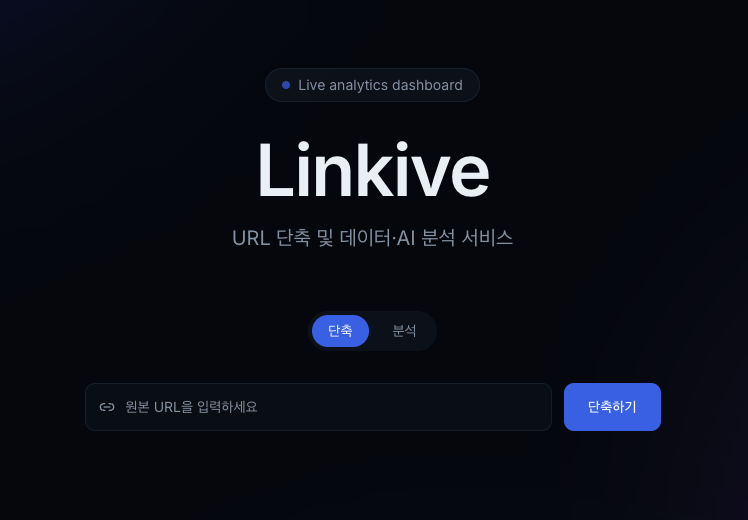
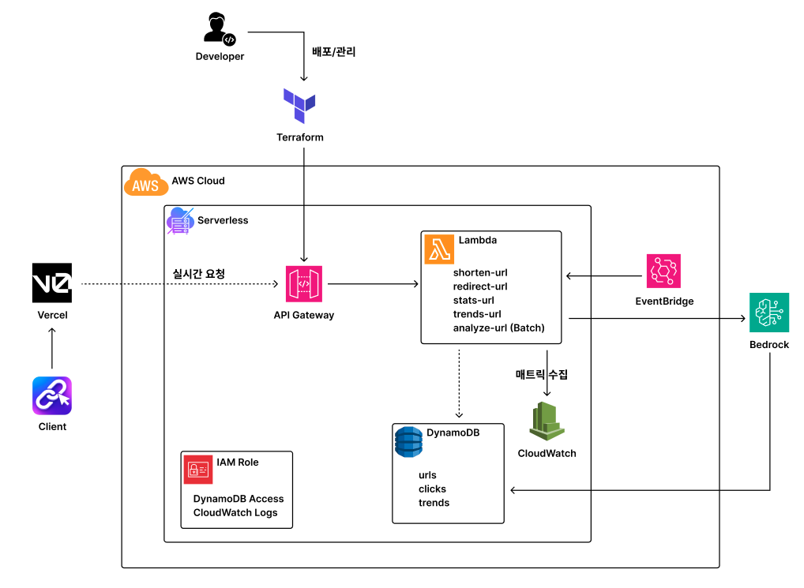
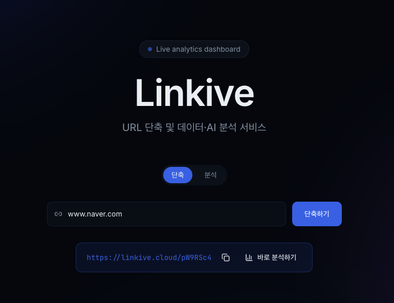
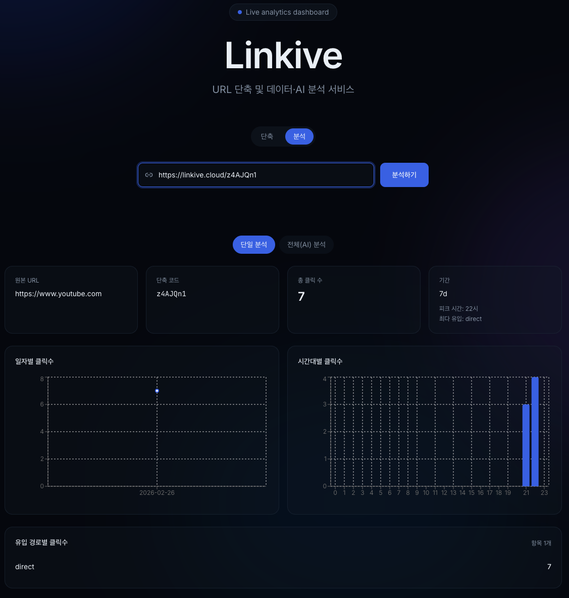
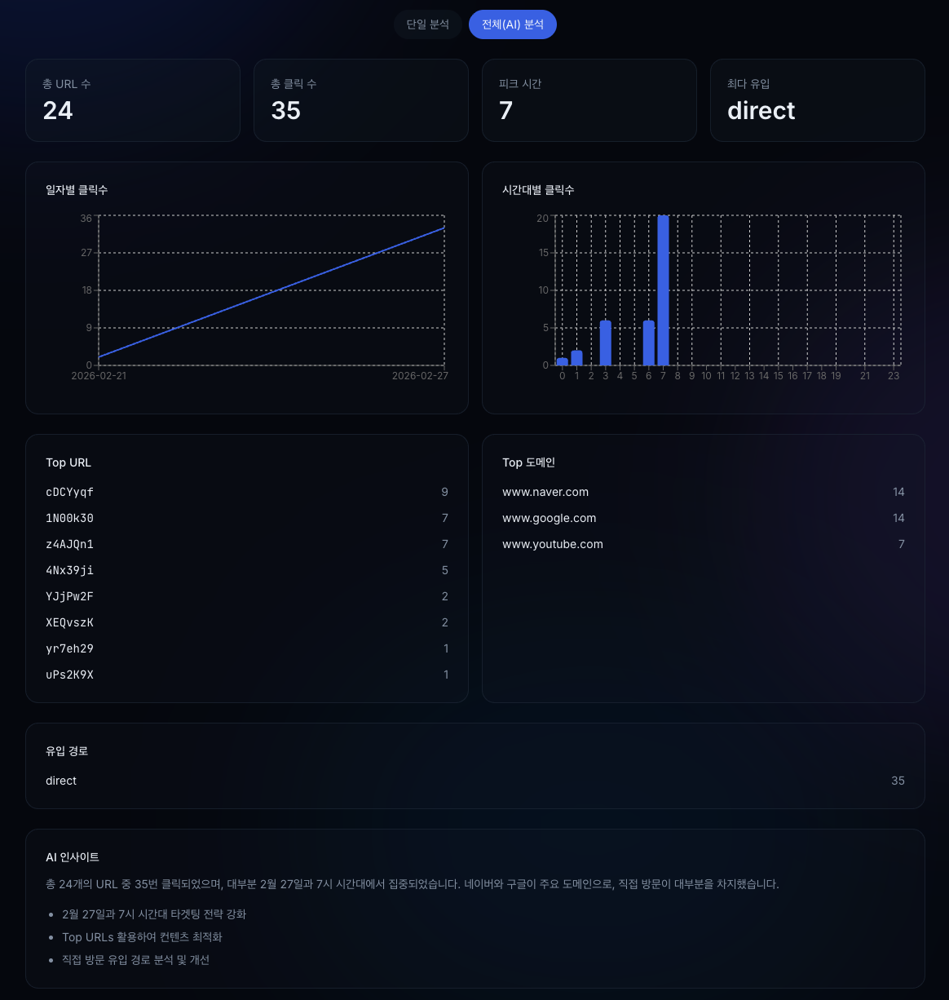
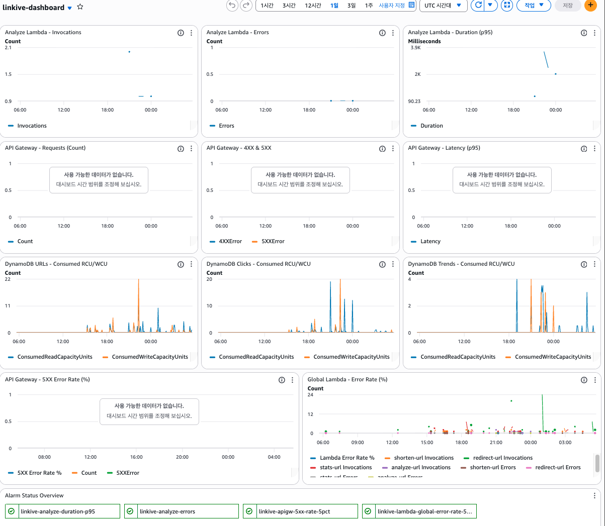

# Linkive

> 서버리스 기반 URL 단축 및 AI 분석 서비스
> 단축 URL 생성부터 단일 링크 통계, 전체 트렌드 분석까지 제공하는 풀스택 프로젝트



---

## Live Demo

- Frontend: https://linkive.cloud
- API: https://api.linkive.cloud

---

## 프로젝트 개요

Linkive는 AWS 서버리스 아키텍처를 기반으로 구축한 URL 단축 서비스입니다.

단순히 링크를 줄이는 것을 넘어 다음 기능을 제공합니다:

- 개별 링크 클릭 통계 분석
- 전체 서비스 트렌드 분석
- AI 기반 인사이트 생성
- 커스텀 도메인 및 HTTPS 적용
- 비용 최적화 설계

---

## 아키텍처



---

## 주요 기능

### 1. URL 단축



- 원본 URL 입력
- 랜덤 shortId 생성
- DynamoDB 저장
- 단축 URL 반환

**API:** `POST /shorten`

---

### 2. 단일 링크 분석



- 총 클릭 수
- 일자별 클릭 수
- 시간대별 클릭 수
- 피크 시간
- 유입 경로 분석

**API:** `GET /stats/{shortId}`

---

### 3. 전체 서비스 분석 (AI 기반)



- 전체 URL 수
- 전체 클릭 수
- Top URL
- Top Domain
- 트래픽 패턴 분석
- AI 요약 인사이트

**API:** `GET /trends`

> 클릭 수가 일정 기준 이상일 때만 Bedrock을 호출하여 비용을 최적화했습니다.

---

### 4. 시각화:
- LineChart (일자별 클릭 수)
- BarChart (시간대별 클릭 수)
- Referer 리스트

---

### 5-1. 모니터링 및 운영 전략



- 모든 Lambda에 구조화 로그 적용:
  - level (INFO / ERROR)
  - type (ACCESS / PERFORMANCE / ERROR)
  - requestId
  - function
  - timestamp
- 운영 중 다음 이벤트 추적 가능:
  - shorten 요청 성공/실패
  - stats 조회 요청
  - analyze 배치 실행
  - Bedrock 호출 여부
  - 에러 발생 로그

### 5-2. CloudWatch Metrics
- lambda Invocation Count
- Duration
- Error Rate
- Throttles

### 5-3. CloudWatch Alarm 구성
- 설정 항목
  - Global Lambda Error Rate
  - Duration 초과 시 알람
  - API Gateway 5XX Error Rate
  - Analyze Error

---

## 기술 스택

### Frontend
- Next.js (App Router)
- TypeScript
- TailwindCSS
- Recharts
- Vercel 배포

### Backend

- AWS Lambda (Python 3.11)
- API Gateway (HTTP API)
- DynamoDB
- Amazon Bedrock

### Infrastructure as Code

- Terraform (모듈화 구조)
- api_gateway
- lambdas (shorten / redirect / stats / analyze / trends)
- iam
- dynamodb

---

## 설계 포인트

### 완전 서버리스 아키텍처
- EC2 없이 서버리스 구성
- 자동 확장
- 사용량 기반 비용 구조

### CORS 문제 해결
- 커스텀 도메인 환경에서 발생한 CORS 이슈 해결
- HTTP API + Lambda 응답 헤더 통합 관리

### AI 비용 최적화
- 클릭 수 threshold 이하일 경우 Bedrock 호출 차단
- maxTokens 제한
- 조건부 인사이트 생성

### 커스텀 도메인 구성
- linkive.cloud (Frontend)
- api.linkive.cloud (API)
- ACM + API Gateway Custom Domain
- Vercel + DNS 연동

---

## 프로젝트 구조

```bash
frontend/
  app/
  components/
  hooks/
  lib/

lambdas/
  shorten/
  stats/
  trends/
  analyze/

terraform/
  modules/
    api_gateway/
    lambdas/
    iam/
    dynamodb/
```

---

## 로컬 실행 방법

### 1. 프론트 실행

```bash
cd frontend
npm install
npm run dev
```

### 2. 인프라 배포
```bash
cd terraform
terraform init
terraform apply
```

---

## 환경 변수

### Frontend (.env.local)
```bash
NEXT_PUBLIC_API_BASE_URL=https://api.linkive.cloud
```

### Terraform (tfvars)
```bash
cors_allow_origins = [
  "https://linkive.cloud",
  "https://www.linkive.cloud",
  "http://localhost:3000"
]
```

---

## 향후 개선 가능 사항

- OAuth 기반 사용자 인증
- 사용자별 대시보드 분리
- Redis 캐싱 도입
- 클릭 이벤트 비동기 처리 (SQS)
- AI 리포트 이메일 발송 기능

---

## 배운 점

- HTTP API와 Lambda Proxy 통합 구조 이해
- CORS 동작 원리 및 실제 운영 환경 문제 해결
- API Gateway Custom Domain 구성
- Bedrock API 통합 및 비용 제어
- Terraform 모듈화 설계 경험

---

## 개발자

한동연
Cloud / DevOps Engineer
AWS 기반 서버리스 아키텍처 설계 및 인프라 자동화 경험